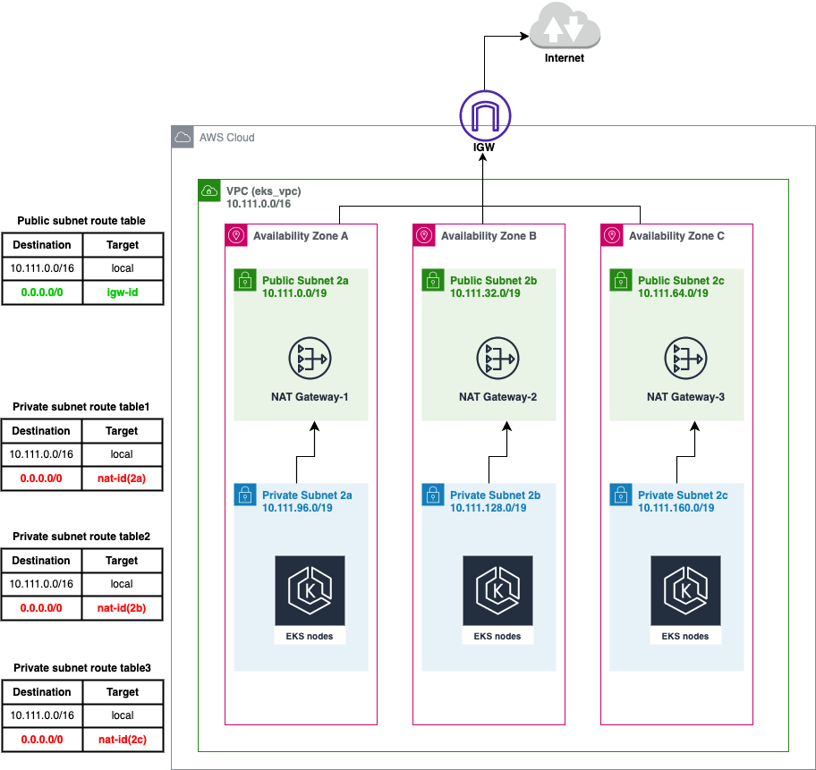

# How to provision an AWS EKS cluster using Terraform
Terraform is an Infrastructure as Code tool that lets you define both cloud and on-premises resources in human-readable configuration files. This guide will help you use Terraform to deploy to EKS.

This repository contains configuration to provision:
+ 1 VPC `eks_vpc`
+ 3 Public Subnets`10.111.0.0/19` `10.111.32.0/19` `10.111.64.0/19`, 3 Private Subnets`10.111.96.0/19` `10.111.128.0/19` `10.111.160.0/19`
+ 4 Routing Tables
+ 1 Internet Gateway
+ 3 NAT Gateway in the different **public** subnets `High Availability`
+ 1 EKS cluster 

The following architecture:


## Provision Infrastructure
Update the configurations based on your personal requirements.

When you get ready, run the commands below:
```
terraform init
terraform plan
terraform apply -var-file eks.tfvars
```

## Connecting to the EKS
Using the same AWS account profile that provisioned the infrastructure, you can connect to your EKS by updating your local kubeconfig:
```
aws eks --region us-west-2 update-kubeconfig --name devops-demo-eks
```

## Testing
Verify `kubectl` with the command below:
```
kubectl get svc
```

## Cleanup
To destroy previously-created infrastructure with Terraform, run the command below:
```
terraform destroy -var-file eks.tfvars
```
